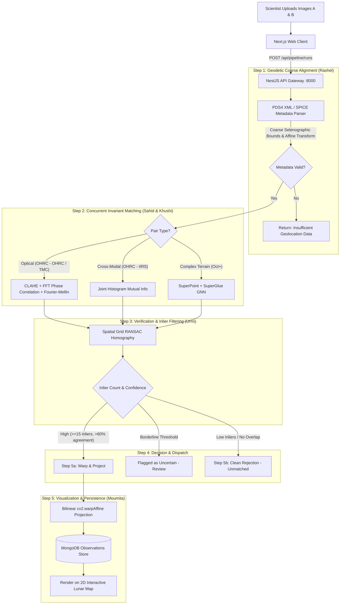

# 🌕 ChandraSetu (चंद्रसेतु)
### *Multi-Modal, Sun-Angle, and Scale-Invariant Lunar Image Correspondence System*
**Smart India Hackathon (SIH) Problem Statement ID: SIH26166**

[](https://github.com/Zen-X5/ChandraSetu/actions/workflows/ci.yml)
[](https://opensource.org/licenses/MIT)
[](https://www.isro.gov.in/)
[](https://nextjs.org/)
[](https://nestjs.com/)

---

## 📌 Executive Summary & The Problem

India's **Chandrayaan-2** orbiter has captured millions of square kilometers of the lunar surface across three distinct scientific instruments:
1. **OHRC (Orbiter High-Resolution Camera)**: Ultra-sharp, sub-meter optical imagery with deep zoom.
2. **TMC (Terrain Mapping Camera)**: Wide-area, stereo optical mapping of lunar topography.
3. **IIRS (Imaging Infra-Red Spectrometer)**: Hyperspectral scans revealing mineral composition and thermal signatures.

### The Scientific Challenge
Photos of the exact same lunar crater or geological formation often look completely unrecognizable across datasets due to:
* **Extreme Illumination Variations:** Drastically different sun elevation and azimuth angles create stark, elongated shadows in craters.
* **Resolution Discrepancies:** Vast scale disparities between zoomed-in OHRC (up to 0.25 m/pixel) and broad-context TMC (~5 m/pixel).
* **Cross-Modal Domain Shift:** Optical reflection (OHRC/TMC) versus hyperspectral absorption bands (IIRS).

Currently, planetary scientists manually match these frames or leave high-value datasets unconnected. **ChandraSetu** bridges this gap by offering an automated, physically grounded, and AI-assisted correspondence engine that matches cross-sensor imagery and accurately stamps verified tiles onto a unified, interactive lunar map.

---

## 🧩 The Core Philosophy: The Honest Lunar Jigsaw

> **"Every verified match is a puzzle piece placed correctly. Unverified areas stay blank."**

ChandraSetu treats lunar mapping with scientific rigor:
- **Zero Hallucination / No Forced Matches:** If two images do not share sufficient overlap or confidence, the system declares **"No Match"** rather than hallucinating a false tie-point.
- **Explicit Uncertainty Handling:** Borderline correspondences are flagged as **"Uncertain — Requires Review"**.
- **Progressive Map Assembly:** Every confirmed match is permanently cataloged in MongoDB and rendered onto the interactive lunar map.

```
       [ Upload 2 Lunar Images ]
                  │
                  ▼
   [ Step 1: Camera Geometry & PDS4 ] ──────  (Missing/Corrupt Metadata) ───► [ ❌ Rejection ]
                  │
                  ▼
      [ Step 2: Invariant Matchers ]
        ├── Optical: CLAHE + Phase Correlation + Fourier-Mellin (Sahid)
        ├── Cross-Modal: Mutual Information (Khushi)
        └── Deep Learning: SuperPoint + SuperGlue (Harish — Oct checkpoint)
                  │
                  ▼
   [ Step 3: Spatial RANSAC + Metrics ] ─── (Low Inliers / Incoherence) ───► [ ❌ Honest Rejection ]
                  │
                  ├── (Borderline Threshold) ───► [ ⚠️ Flag for Review ]
                  │
                  ▼ (Confidence Passed)
   [ Step 4: Bilinear Geodetic Warping ]
                  │
                  ▼
   [ 🌕 Stamped on Lunar GIS Canvas & Saved to MongoDB ]
```

---

## 👥 Engineering Team & Responsibilities

| Contributor | Specialized Module | Core Responsibilities |
| :--- | :--- | :--- |
| **Rashel** | **Camera Geometry & PDS4** | Parses PDS4 XML labels, georeferencing metadata, extracts selenographic coordinate bounds, and performs initial coarse affine transforms. ✅ Tests passing. |
| **Sahid** | **Illumination & Scale Invariance** | Sub-pixel 2D Phase Correlation, Hanning windowing (<0.25 px accuracy), CLAHE shadow normalization, Log-Polar / Fourier-Mellin scale & rotation recovery, uniform spatial grid candidate generation. ✅ 12/12 tests passing. |
| **Khushi** | **Cross-Modal Correspondence** | Handles OHRC↔IIRS pairs using joint entropy histograms, mutual information (MI) maximization, and multi-resolution hill climbing. 🔄 In progress. |
| **Urmi** | **Geometric Validation & RANSAC** | Spatial grid RANSAC homography validation, split-axis RMSE (RMSE_X / RMSE_Y) per SAC/ISRO 2025 standard, Shannon entropy spatial distribution scoring, composite homography refinement. ✅ 18/18 tests passing. |
| **Harish** | **Deep Learning Matcher** | Pretrained SuperPoint + SuperGlue GNN benchmarked for complex lunar features and cross-modality. 🔲 Deferred to October checkpoint. |
| **Moumita** | **Frontend UI, Lunar Map & DB** | Next.js 16 interactive dashboard, mission control tour, pipeline stage stepper, Redux Toolkit state management, MongoDB observations persistence. ✅ Core UI operational. |

---

## 🔬 Multi-Stage Processing Pipeline



---

## 🏗️ Repository Structure

```
ChandraSetu/
├── .github/
│   └── workflows/
│       └── ci.yml                     # Automated CI build & lint/test pipeline
├── docker-compose.yml                 # Full local stack (all 7 services)
├── docker-compose.prod.yml            # Production stack (pre-built GHCR images)
├── start.bat                          # Windows one-click launcher
├── gateway/                           # NestJS API Gateway & Pipeline Orchestrator (:8000)
│   └── src/
│       ├── auth/                      # JWT auth, guards & role RBAC
│       ├── images/                    # PDS4 upload handling & MinIO S3 integration
│       ├── pipeline/                  # Pipeline orchestrator & run tracking (PipelineRun schema)
│       ├── observations/              # Scientific observation records & MoonMapPatch
│       ├── user/                      # User management & scientist profiles
│       ├── session/                   # Session management
│       └── storage/                   # MinIO S3 storage abstraction
├── vision-service/                    # Python / FastAPI Computer Vision Microservice (:8001)
│   ├── app/
│   │   ├── geometry/                  # Rashel: PDS4 parser, coarse_align, camera_geometry, projection
│   │   ├── matching/                  # Sahid & Khushi: phase_correlation, mutual_information, preprocessing
│   │   ├── validation/                # Urmi: ransac, spatial_distribution, metrics
│   │   ├── pipeline/                  # Pipeline coordination
│   │   ├── schemas/                   # Pydantic request/response models
│   │   ├── storage/                   # S3/MinIO file access
│   │   └── utils/                     # Shared utilities
│   └── tests/
│       ├── test_geometry.py           # Rashel's PDS4 & alignment tests
│       ├── test_matching.py           # Sahid's tests (12/12 passing)
│       └── test_validation.py         # Urmi's tests (18/18 passing)
├── inference-service/                 # Python / PyTorch Deep Learning Microservice (:8002)
│   └── app/
│       ├── inference/                 # SuperPoint + SuperGlue neural matchers (scaffolded)
│       ├── models/                    # Model loader and weight management
│       ├── schemas/                   # Request/response types
│       └── weights/                   # Model weight files (not committed)
├── web/                               # Next.js 16 Lunar Dashboard & GIS Client (:3000)
│   ├── app/
│   │   ├── auth/                      # Login / registration pages
│   │   └── dashboard/
│   │       ├── page.tsx               # Mission control home with guided tour
│   │       ├── pipeline/              # Image upload & live pipeline stage stepper
│   │       ├── observations/          # Historical observation log
│   │       ├── scientists/            # Team directory
│   │       ├── settings/              # User settings
│   │       └── staff/                 # Admin staff management
│   ├── lib/
│   │   ├── features/auth/             # Redux auth slice (RTK Query)
│   │   ├── hooks/                     # Custom React hooks
│   │   ├── services/                  # API service clients
│   │   ├── store/                     # Redux Toolkit store
│   │   └── utils/                     # Shared utilities
│   └── proxy.ts                       # Next.js reverse proxy → Gateway
├── uploads/                           # Temporary image upload buffer
└── README.md
```

---

## 🗄️ MongoDB Data Model (5 Collections)

All schemas use `@Schema({ timestamps: true })` — `createdAt` / `updatedAt` are automatic.

| Collection | Key Fields | Notes |
| :--- | :--- | :--- |
| **User** | `email`, `passwordHash` (bcrypt, `select:false`), `role` (scientist/reviewer/admin), `deletedAt` | Soft-delete; password never stored raw |
| **RawImage** | `storageRef` (MinIO object key), `contentHash` (`unique:true` — dedup), `instrument` (OHRC/TMC/IIRS), PDS4 metadata (projection, corners, resolution, acquisitionTime) | Duplicate uploads are rejected/reused at DB level |
| **PipelineRun** | `runId`, `sourceImageId`, `referenceImageId` (optional), `currentStage` (INGESTION→GEOMETRY→MATCHING→VALIDATION→COMPLETED/FAILED), `status`, stage result payloads | No circular FK — look up Observation via `Observation.runId` |
| **Observation** | `runId` (optional), `matchedPoints[]` (RANSAC-validated — required PS deliverable), `confidence.rmseX/Y`, `confidence.spatialDistributionScore`, `matchStatus` (MATCHED/UNCERTAIN/UNMATCHED), `singleImagePlacement`, `duplicateOf`, `deletedAt` | Permanent scientific record — soft delete only |
| **MoonMapPatch** | `observationId` (`unique:true`), `regionBounds` {minLat, maxLat, minLon, maxLon} | Directly feeds Leaflet `L.imageOverlay()` |

---

## 🎯 Case Matrix & Robustness Handling

| Scenario | Challenge | ChandraSetu Solution |
| :--- | :--- | :--- |
| **Varying Sun Angles** | Craters have inverted/elongated shadow profiles | CLAHE contrast equalization + Fourier Phase Correlation focus on structural geometry, not illumination intensity |
| **Scale Discrepancy (OHRC vs TMC)** | Zoom & detail levels differ by orders of magnitude | Fourier-Mellin transform & multi-scale pyramid representations align scale invariants |
| **Cross-Modality (OHRC vs IIRS)** | Optical pixel brightness ≠ infrared spectral bands | Normalized Mutual Information (NMI) and SuperGlue learned geometric priors |
| **Completely Different Regions** | Non-overlapping areas must never be forced together | RANSAC homography fails threshold → system cleanly rejects with `match_status: "unmatched"` |
| **Tiny Sliver Overlap** | Sparse shared surface with high risk of false correlation | Spatial grid coverage checks (Shannon entropy scoring) ensure matches are evenly distributed |
| **Featureless Mare Plains** | Smooth basaltic plains lacking distinct crater landmarks | Match entropy evaluated; ambiguous results flagged as `"uncertain - needs review"` |
| **Missing / Broken Metadata** | Corrupted PDS4 headers or incomplete orbital records | Immediate early exit at Step 1 with actionable UI diagnostics |

---

## ⚡ Running Locally

### Prerequisites

| Requirement | Version |
| :--- | :--- |
| Docker & Docker Compose | Latest |
| Node.js | v20.x+ |
| Python | 3.10+ |

---

### 🐳 Option A — Full Docker Stack (Recommended)

One command starts **all 7 services** (MongoDB, MinIO, vision-service, inference-service, gateway, web):

```bash
docker compose up -d
```

Or on Windows, double-click **`start.bat`**.

| Service | URL | Notes |
| :--- | :--- | :--- |
| 🌕 Web Dashboard | http://localhost:3000 | Next.js frontend |
| ⚙️ API Gateway | http://localhost:8000/api | NestJS REST API |
| 👁️ Vision Engine | http://localhost:8001 | FastAPI + OpenCV pipeline |
| 🧠 Inference Engine | http://localhost:8002 | FastAPI + PyTorch (SuperGlue) |
| 🗄️ MongoDB | mongodb://localhost:27017/chandrasetu | — |
| 📦 MinIO S3 API | http://localhost:9000 | Object storage |
| 📦 MinIO Console | http://localhost:9001 | Login: `minioadmin` / `minioadmin` |

To stop all services:
```bash
docker compose down
```

To stop and wipe all data volumes:
```bash
docker compose down -v
```

---

### 🛠️ Option B — Manual / Per-Service Development

Use this when you want hot-reload and local debugging for specific services.

#### 1. Start Infrastructure (MongoDB + MinIO only)
```bash
docker compose up -d mongodb minio minio-init
```

#### 2. Vision Service (FastAPI — Rashel, Sahid, Khushi, Urmi)
```bash
cd vision-service
python -m venv venv
# Windows: .\venv\Scripts\activate | Linux/macOS: source venv/bin/activate
pip install -r requirements.txt
uvicorn app.main:app --port 8001 --reload
```
Interactive API docs → http://localhost:8001/docs

#### 3. Inference Service (FastAPI + PyTorch — Harish)
```bash
cd inference-service
python -m venv venv
# Windows: .\venv\Scripts\activate | Linux/macOS: source venv/bin/activate
pip install -r requirements.txt
uvicorn app.main:app --port 8002 --reload
```

#### 4. API Gateway (NestJS)
```bash
cd gateway
npm install
npm run start:dev
```
Gateway runs at → http://localhost:8000/api

#### 5. Web Frontend (Next.js)
```bash
cd web
npm install
npm run dev
```
Dashboard → http://localhost:3000

---

### 🧪 Running Tests

```bash
# Vision service — all pytest suites
cd vision-service
pytest tests/ -v

# Gateway — NestJS unit & e2e
cd gateway
npm test
```

**Current test coverage:**
- `test_geometry.py` — ✅ Rashel's PDS4 / coarse alignment tests
- `test_matching.py` — ✅ **12/12 passing** (Sahid: phase correlation, CLAHE, Fourier-Mellin)
- `test_validation.py` — ✅ **18/18 passing** (Urmi: RANSAC, RMSE_X/Y, spatial distribution)

---

## 🚀 Production Deployment

A separate `docker-compose.prod.yml` uses pre-built images from **GitHub Container Registry (GHCR)** instead of building from source. It connects to a cloud MongoDB Atlas cluster and supports environment-variable-driven secrets.

```bash
docker compose -f docker-compose.prod.yml up -d
```

Required environment variables (set in shell or `.env`):

| Variable | Description |
| :--- | :--- |
| `MONGO_URL` | MongoDB Atlas connection string |
| `JWT_SECRET` | JWT signing secret |
| `DEFAULT_ADMIN_EMAIL` | Seed admin account email |
| `DEFAULT_ADMIN_PASSWORD` | Seed admin account password |
| `S3_ACCESS_KEY` | MinIO / S3 access key |
| `S3_SECRET_KEY` | MinIO / S3 secret key |
| `REPO_OWNER` | GitHub username for GHCR image pulls (default: `zen-x5`) |

---

## 📊 Roadmap & Milestones

- [x] **Phase 0: Workspace & Monorepo Foundation** — Root Git, CI/CD pipeline, Docker Compose full stack, environment configuration
- [x] **Phase 0.5: Backend Foundation** — All 5 Mongoose schemas, NestJS modules (Auth, Users, Images, Pipeline, Observations, Storage, Session), JWT auth, MinIO S3 integration
- [x] **Phase 1: MVP Core Pipeline (Sept 15)**
  - [x] PDS4 XML metadata parser & coarse geodetic alignment (Rashel)
  - [x] Sub-pixel 2D Phase Correlation + Hanning windowing (<0.25 px) (Sahid)
  - [x] CLAHE + shadow-tolerant normalization per SAC/ISRO 2025 standard (Sahid)
  - [x] Log-Polar / Fourier-Mellin scale & rotation recovery (Sahid)
  - [x] Uniform spatial grid correspondence generator (Sahid)
  - [x] RANSAC homography with sub-pixel RMSE (<0.5 px) (Urmi)
  - [x] Shannon entropy spatial distribution scoring (Urmi)
  - [x] Split-axis RMSE (RMSE_X, RMSE_Y) per SAC/ISRO 2025 standard (Urmi)
  - [x] Composite homography refinement (Urmi)
  - [x] Strict decision classifier: MATCHED / UNCERTAIN / UNMATCHED (Urmi)
  - [x] Next.js dual-slot upload form + live pipeline stage stepper (Moumita)
  - [x] Mission Control guided tour (Moumita)
  - [x] "No Match" & "Uncertain — Needs Review" UI states (Moumita)
  - [x] Upload endpoint + MongoDB write (Moumita)
  - [ ] Leaflet 2D Lunar Map with custom selenographic CRS & tile stamping
  - [ ] Mutual Information cross-modal matching (Khushi)

- [ ] **Phase 2: Advanced Capabilities (Finale)**
  - Cross-modal OHRC ↔ IIRS Mutual Information matching (Khushi)
  - Full MongoDB Observation history & timeline UI
  - Interactive 3D Lunar Globe integration (Three.js)
  - Before/after alignment toggle overlay

- [ ] **Phase 3: Deep Learning Track (October checkpoint)**
  - SuperPoint + SuperGlue feature matching (Harish)
  - GPU inference pipeline activation

---

## 🔬 Scientific Grounding

Validated against published ISRO research:

> Makharia, Singla, Amitabh, Dube, Sharma (2025). *"Comparative Evaluation of Traditional and Deep Learning Feature Matching Algorithms using Chandrayaan-2 Lunar Data."* SAC/ISRO Ahmedabad — [arXiv:2509.04775](https://arxiv.org/abs/2509.04775)

Key findings informing our design:
- SuperGlue (pretrained) achieved **0.62 px RMSE** on OHRC↔NAC benchmark — validates Harish's stretch-goal module
- Classical methods (AKAZE) remain competitive on some IIRS↔WAC polar cases — deep learning is not a blanket winner
- CLAHE, shadow normalization, histogram matching, and PCA preprocessing are reused directly in Sahid/Khushi stages
- Metadata-based projection georeferencing validates our lighter metadata-first approach over full SPICE ray-tracing

---

## 🌍 Impact for Planetary Exploration

ChandraSetu directly supports ISRO's mission planning and scientific workflows:
* **Landing Site Characterization:** High-precision cross-referencing of hazard-detection imagery (OHRC) against regional context (TMC) for future missions (Chandrayaan-4 / LUPEX).
* **Resource Prospecting:** Fusing high-resolution visual landmarks with IIRS hyperspectral mineral and water-ice maps.
* **Unified Planetary GIS:** Automatically transforming fragmented orbiter passes into a cohesive, growing lunar atlas.
* **Data Sovereignty:** Self-hosted MinIO object storage ensures all ISRO satellite data stays on-premise — no cloud dependency.

---

<div align="center">
  <sub>Built with ❤️ for Smart India Hackathon & Planetary Science Innovation.</sub>
</div>
