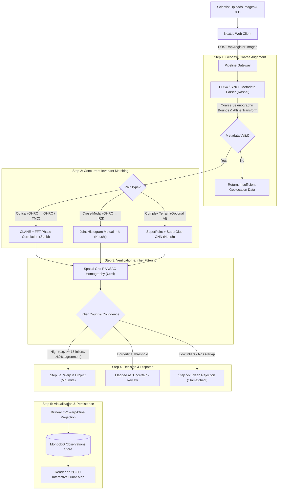

# 🌕 ChandraSetu (चंद्रसेतु)
### *Multi-Modal, Sun-Angle, and Scale-Invariant Lunar Image Correspondence System*
**Smart India Hackathon (SIH) Problem Statement ID: SIH26166**

[](https://github.com/Zen-X5/ChandraSetu/actions/workflows/ci.yml)
[](https://opensource.org/licenses/MIT)
[](https://www.isro.gov.in/)
[](https://nextjs.org/)
[](https://nestjs.com/)

---

## 📌 Executive Summary & The Problem

India’s **Chandrayaan-2** orbiter has captured millions of square kilometers of the lunar surface across three distinct scientific instruments:
1. **OHRC (Orbiter High-Resolution Camera)**: Ultra-sharp, sub-meter optical imagery with deep zoom.
2. **TMC (Terrain Mapping Camera)**: Wide-area, stereo optical mapping of lunar topography.
3. **IIRS (Imaging Infra-Red Spectrometer)**: Hyperspectral scans revealing mineral composition and thermal signatures.

### The Scientific Challenge
Photos of the exact same lunar crater or geological formation often look completely unrecognizable across datasets due to:
* **Extreme Illumination Variations:** Drastically different sun elevation and azimuth angles create stark, elongated shadows in craters.
* **Resolution Discrepancies:** Vast scale disparities between zoomed-in OHRC (up to 0.25m/pixel) and broad-context TMC (~5m/pixel).
* **Cross-Modal Domain Shift:** Optical reflection (OHRC/TMC) versus hyperspectral absorption bands (IIRS).

Currently, planetary scientists manually match these frames or leave high-value datasets unconnected. **ChandraSetu** bridges this gap by offering an automated, physically grounded, and AI-assisted correspondence engine that matches cross-sensor imagery and accurately stamps verified tiles onto a unified, interactive lunar map.

---

## 🧩 The Core Philosophy: The Honest Lunar Jigsaw

> **"Every verified match is a puzzle piece placed correctly. Unverified areas stay blank."**

ChandraSetu treats lunar mapping with scientific rigor:
- **Zero Hallucination / No Forced Matches:** If two images do not share sufficient overlap or confidence, the system declares **"No Match"** rather than hallucinating a false tie-point.
- **Explicit Uncertainty Handling:** Borderline correspondences are flagged as **"Uncertain — Requires Review"**.
- **Progressive Map Assembly:** Every confirmed match is permanently cataloged in MongoDB and rendered onto the interactive lunar map.

```
       [ Upload 2 Lunar Images ]
                  │
                  ▼
   [ Step 1: Camera Geometry & SPICE ] ────── (Missing/Corrupt Metadata) ───► [ ❌ Rejection ]
                  │
                  ▼
      [ Step 2: Invariant Matchers ]
        ├── Optical: CLAHE + Phase Corr (Sahid)
        ├── Cross-Modal: Mutual Info (Khushi)
        └── Deep Learning: SuperPoint + SuperGlue (Harish)
                  │
                  ▼
   [ Step 3: Spatial Inlier RANSAC ] ──────── (Low Inlier / Incoherence) ───► [ ❌ Honest Rejection ]
                  │
                  ├── (Borderline Threshold) ───► [ ⚠️ Flag for Review ]
                  │
                  ▼ (Confidence Passed)
   [ Step 5a: Bilinear Geodetic Warping ]
                  │
                  ▼
   [ 🌕 Stamped on Lunar GIS Canvas & Saved to DB ]
```

---

## 👥 Engineering Team & Responsibilities

| Contributor | Specialized Module | Core Responsibilities |
| :--- | :--- | :--- |
| **Rashel** | **Camera Geometry & SPICE / PDS4** | Parses PDS4 labels, georeferencing metadata, extracts selenographic coordinate bounds, and performs initial coarse affine transforms. |
| **Sahid** | **Illumination & Scale Invariance** | Optical image registration via CLAHE, 2D FFT cross-power spectrum phase correlation, and log-polar / Fourier-Mellin scale handling. |
| **Khushi** | **Cross-Modal Correspondence** | Handles OHRC↔IIRS pairs using joint entropy histograms, mutual information (MI) maximization, and multi-resolution hill climbing. |
| **Urmi** | **Geometric Validation & RANSAC** | Spatially distributed grid sampling, homography validation with RANSAC inlier thresholding, and false-positive rejection. |
| **Harish** | **Deep Learning Matcher** | Pretrained SuperPoint + SuperGlue transformer graph neural network benchmarked for complex lunar features and cross-modality. |
| **Moumita** | **Frontend UI, Lunar Map & DB** | Next.js 16 interactive dashboard, Leaflet/WebGL lunar globe, real-time pipeline telemetry, and MongoDB observation persistence. |

---

## 🔬 Multi-Stage Processing Pipeline



---

## 🎯 Case Matrix & Robustness Handling

| Scenario | Challenge | ChandraSetu Solution |
| :--- | :--- | :--- |
| **Varying Sun Angles** | Craters have inverted/elongated shadow profiles. | CLAHE contrast equalization + Fourier Phase Correlation focus on structural geometry rather than illumination intensity. |
| **Scale Discrepancy (OHRC vs TMC)** | Zoom & detail levels differ by orders of magnitude. | Fourier-Mellin transform & multi-scale pyramid representations align scale invariants. |
| **Cross-Modality (OHRC vs IIRS)** | Optical pixel brightness does not match infrared spectral bands. | Normalized Mutual Information (NMI) and SuperGlue learned geometric priors. |
| **Completely Different Regions** | Non-overlapping areas must never be forced together. | RANSAC homography fails threshold check $\rightarrow$ system cleanly rejects with **`match_status: "unmatched"`**. |
| **Tiny Sliver Overlap** | Sparse shared surface area with high risk of false correlation. | Spatial grid coverage checks ensure matches are evenly distributed across the overlap region. |
| **Featureless Mare Plains** | Smooth basaltic plains lacking distinct crater landmarks. | Evaluates match entropy and flags ambiguous results as **`"uncertain - needs review"`**. |
| **Missing / Broken Metadata** | Corrupted PDS4 headers or incomplete orbital records. | Immediate early exit at Step 1 with actionable UI diagnostics without wasting compute. |

---

## 🏗️ Repository Structure

```
ChandraSetu/
├── .github/
│   └── workflows/
│       └── ci.yml                 # Automated CI build & test pipeline
├── gateway/                       # API Gateway & Backend Services
│   ├── src/                       # NestJS API controllers, services, modules
│   ├── test/                      # Unit and integration test suites
│   ├── package.json
│   └── tsconfig.json
├── web/                           # Interactive Lunar Dashboard & GIS Client
│   ├── src/
│   │   ├── app/                   # Next.js App Router (Dashboard, Map, Viewer)
│   │   └── components/            # Upload widget, pipeline telemetry, Lunar Canvas
│   ├── public/                    # Static assets & lunar basemap tiles
│   ├── package.json
│   └── tailwind.config.ts
├── .gitignore                     # Root-level ignore rules
└── README.md                      # Project documentation
```

---

## ⚡ Quickstart & Local Development

### Prerequisites
- **Node.js**: v20.x or higher
- **npm**: v10.x or higher
- **Python**: 3.10+ (for backend geospatial/vision dependencies)
- **MongoDB**: Local or Atlas instance

### 1. Clone the Repository
```bash
git clone https://github.com/Zen-X5/ChandraSetu.git
cd ChandraSetu
```

### 2. Setup & Run the Gateway
```bash
cd gateway
npm install
npm run start:dev
```
*The API gateway starts on `http://localhost:3000` (or configured port).*

### 3. Setup & Run the Web Application
```bash
cd ../web
npm install
npm run dev
```
*Open [http://localhost:3000](http://localhost:3000) (or Next.js port) in your browser to view the dashboard.*

---

## 📊 Roadmap & Project Milestones

- [x] **Phase 0: Workspace & Monorepo Foundation** (Root Git, CI/CD Pipeline, Environment Configuration)
- [ ] **Phase 1: MVP Release (Sept 15)**
  - Dual-slot image upload interface with live pipeline progress indicators.
  - PDS4 / metadata parser for coarse coordinate localization.
  - Optical CLAHE + Phase Correlation matching engine (OHRC ↔ OHRC / TMC).
  - Spatial RANSAC validation & honest negative rejection demo.
  - 2D Leaflet-based Lunar viewport with stamped tile projection.
- [ ] **Phase 2: Advanced Capabilities (Finale)**
  - Cross-modal OHRC ↔ IIRS Mutual Information matching.
  - Full MongoDB persistence with historical observation timeline.
  - Interactive 3D Lunar Globe integration.
- [ ] **Phase 3: Deep Learning Track (Stretch Goal)**
  - SuperPoint + SuperGlue feature matching integration for low-texture and extreme cross-modality lunar scenes.

---

## 🚀 Impact for Planetary Exploration

ChandraSetu directly supports ISRO's mission planning and scientific workflows:
* **Landing Site Characterization:** High-precision cross-referencing of hazard-detection imagery (OHRC) against regional context (TMC) for future missions (e.g., Chandrayaan-4 / LUPEX).
* **Resource Prospecting:** Fusing high-resolution visual landmarks with IIRS hyperspectral mineral and water-ice maps.
* **Unified Planetary GIS:** Automatically transforming fragmented orbiter passes into a cohesive, growing lunar atlas.

---

<div align="center">
  <sub>Built with ❤️ for Smart India Hackathon & Planetary Science Innovation.</sub>
</div>
